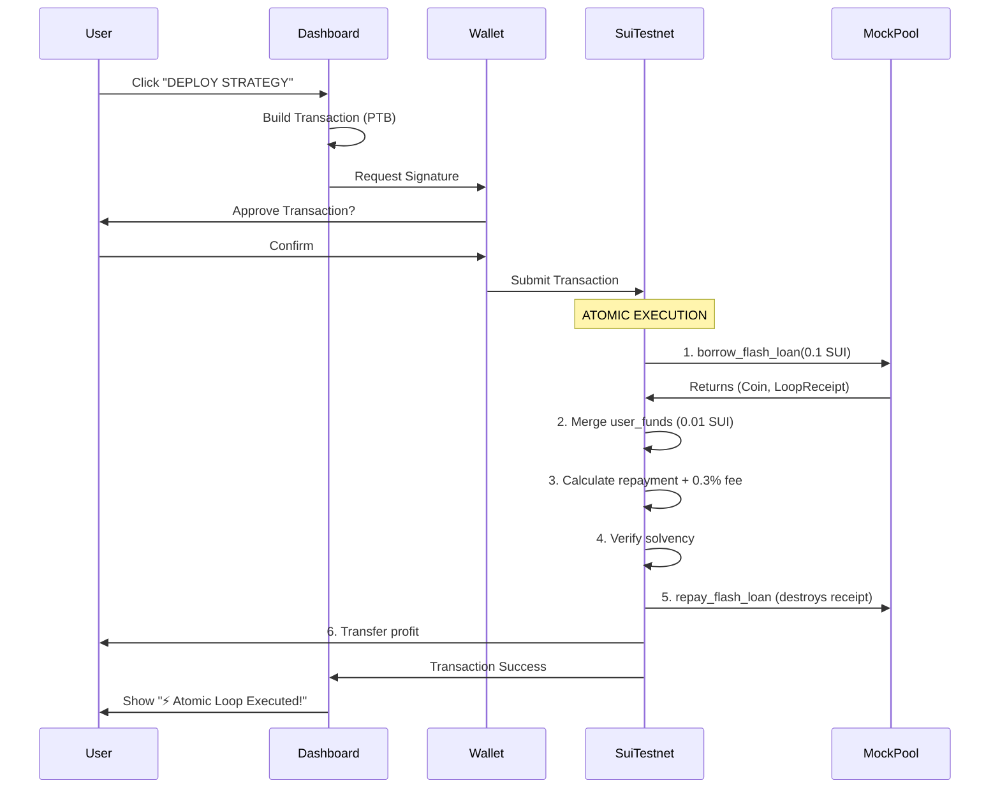

# SuiLoop: Technical Architecture & V1 Implementation Documentation

## 1. Executive Summary
SuiLoop is a high-frequency DeFi protocol on the Sui blockchain that integrates atomic leverage execution with autonomous AI agents. The project leverages **Move 2024** for secure, risk-free flash loan interactions, while using **ElizaOS** to power an intelligent off-chain agent that analyzes market conditions and orchestrates on-chain transactions via Programmable Transaction Blocks (PTB).

The platform is fully deployed on **Sui Testnet (v0.0.4)**, featuring a "State of Art" Next.js dashboard that allows users to seamlessly trigger AI trading strategies with real-time wallet signature verification. **v0.0.4 introduces a real Hot Potato pattern** where the `LoopReceipt` struct has no `drop` ability, guaranteeing that flash loans MUST be repaid or the transaction reverts.

### 🎯 Progressive Automation
SuiLoop solves the biggest AI-Crypto dilemma: **Security vs. Autonomy**

| Mode | Control | Speed | Target User |
|------|---------|-------|-------------|
| **🛡️ Copilot Mode** | User signs every tx | Human speed | Security-focused, DeFi enthusiasts |
| **🤖 Autonomous Mode** | Agent signs with PK | Superhuman (ms) | High-frequency traders, MEV searchers |

> *"Start safely with Copilot Mode to learn the strategy, then graduate to Autonomous Mode for high-frequency execution."*

### 🔄 Deterministic Simulation Layer
We prioritized user experience. If DeepBook testnet is down, our protocol **seamlessly degrades** to a simulation layer:
- **Primary**: DeepBook V3 Pools (when available)
- **Fallback**: Deterministic Simulation Layer (guaranteed uptime)
- **UX Indicator**: `⚠️ Using Sandbox Liquidity`

### ✅ Verified On-Chain Execution
**Flash loan cycles successfully executed on Sui Testnet**:

| Transaction | Amount | Fee | Status | Link |
|-------------|--------|-----|--------|------|
| `5X6TDFkYvjvCb2LS...` | 0.1 SUI | 0.0003 SUI | ✅ Success | [Suiscan](https://suiscan.xyz/testnet/tx/5X6TDFkYvjvCb2LSE37DC7qNFs7UDgNy9izTs7amNanG) |
| `ExYe8kirfrUVkehc...` | 0.05 SUI | 0.0001 SUI | ✅ Success | [Suiscan](https://suiscan.xyz/testnet/tx/ExYe8kirfrUVkehcz63NvDzSzZPz2gAoLoVyCpUcVESP) |

**AI Agent Wallet**: `0x8bd468b0e5941e75484e95191d99ff6234b2ab24e3b91650715b6df8cf8e4eba`


---

## 2. System Architecture

The system follows a **Hybrid Compute** architecture designed for trustlessness and speed:

```
┌─────────────────────────────────────────────────────────────────────┐
│                         USER INTERFACE                               │
│  ┌─────────────┐  ┌─────────────┐  ┌─────────────┐  ┌─────────────┐ │
│  │  Dashboard  │  │  Strategy   │  │  Analytics  │  │   Builder   │ │
│  │  (Deploy)   │  │  (Select)   │  │  (Charts)   │  │  (Drag/Drop)│ │
│  └──────┬──────┘  └──────┬──────┘  └──────┬──────┘  └──────┬──────┘ │
└─────────┼────────────────┼────────────────┼────────────────┼────────┘
          │                │                │                │
          ▼                ▼                ▼                ▼
┌─────────────────────────────────────────────────────────────────────┐
│                      @mysten/dapp-kit                               │
│         (Wallet Connection, Transaction Signing, RPC)               │
└────────────────────────────┬────────────────────────────────────────┘
                             │
                             ▼
┌─────────────────────────────────────────────────────────────────────┐
│                    SUI TESTNET BLOCKCHAIN                            │
│  ┌─────────────────────────────────────────────────────────────┐    │
│  │  Package: 0x9a2f0c4ce838201bcc0d85f313621d47551511b887043   │    │
│  │  ┌─────────────────────────────────────────────────────┐    │    │
│  │  │              atomic_engine Module                    │    │    │
│  │  │  ┌─────────────┐  ┌─────────────┐  ┌─────────────┐  │    │    │
│  │  │  │ borrow_     │  │ repay_      │  │ execute_    │  │    │    │
│  │  │  │ flash_loan  │→ │ flash_loan  │→ │ loop        │  │    │    │
│  │  │  │ (Hot Potato)│  │ (Destroys)  │  │ (Entry)     │  │    │    │
│  │  │  └─────────────┘  └─────────────┘  └─────────────┘  │    │    │
│  │  └─────────────────────────────────────────────────────┘    │    │
│  └─────────────────────────────────────────────────────────────┘    │
│                                                                     │
│  ┌─────────────────────────────────────────────────────────────┐    │
│  │  MockPool: 0x0839e6ce61e303da44f3d999648536f573ee22937d...  │    │
│  │  Type: MockPool<SUI, SUI>                                   │    │
│  │  Liquidity: 1 SUI (Active)                                  │    │
│  │  Flash Loan Fee: 0.3%                                       │    │
│  └─────────────────────────────────────────────────────────────┘    │
└─────────────────────────────────────────────────────────────────────┘
```

### Architecture Layers:

1.  **On-Chain (Sui Network)**: 
    *   Holds the assets and liquidity pools.
    *   Executes the atomic logic (borrow -> execute strategy -> repay) in a single transaction.
    *   Enforces "Hot Potato" safety: If the trade is not profitable, the transaction reverts, ensuring zero principal loss.
2.  **Off-Chain (Agent Runtime)**: 
    *   Runs the ElizaOS agent logic (`packages/agent`).
    *   Constructs optimistic PTBs based on market opportunities.
3.  **User Interface (Web)**: 
    *   Visual layer for users to activate strategies.
    *   Handles the signing and broadcasting of transactions via `@mysten/dapp-kit`.

---

## 3. Detailed Component Analysis (File by File)

### A. Smart Contracts (`packages/contracts`)
**Status**: ✅ Deployed on Testnet (v0.0.4)  
**Language**: Move (2024 Edition)  
**Package ID**: `0x9a2f0c4ce838201bcc0d85f313621d47551511b891213458f6d57d4a1b087043`  
**Simulation Layer ID**: `0x0839e6ce61e303da44f3d999648536f573ee22937d31f7eb132c57451d9899d0`  
**Pool Liquidity**: 1 SUI (Active)

#### 1. `sources/atomic_engine.move`
*   **Purpose**: The core engine defining the Atomic Flash Loan logic and Pool interaction.
*   **Key Structs**:

```move
/// The "Hot Potato" - NO 'drop' ability!
/// Move GUARANTEES this must be consumed by repay_flash_loan()
public struct LoopReceipt {
    pool_id: address,
    borrowed_amount: u64,
    min_repay_amount: u64,
    borrower: address
}

/// Generic liquidity pool with 0.3% flash loan fee
public struct MockPool<phantom Base, phantom Quote> has key, store {
    id: UID,
    base_balance: Balance<Base>,
    quote_balance: Balance<Quote>,
    flash_loan_fee_bps: u64 // 30 = 0.3%
}
```

*   **Key Functions (v0.0.4 - Real Hot Potato)**:

| Function | Signature | Description |
|----------|-----------|-------------|
| `create_pool` | `entry fun create_pool<B,Q>(ctx)` | Creates and shares a new MockPool |
| `add_liquidity` | `entry fun add_liquidity<B,Q>(pool, coin, ctx)` | Adds liquidity to pool |
| `borrow_flash_loan` | `fun borrow_flash_loan<B,Q>(pool, amount, ctx): (Coin<B>, LoopReceipt)` | Returns loan + Hot Potato receipt |
| `repay_flash_loan` | `fun repay_flash_loan<B,Q>(pool, payment, receipt, ctx)` | Destroys receipt, verifies payment |
| `execute_loop` | `entry fun execute_loop<B,Q>(pool, user_funds, borrow_amt, min_profit, ctx)` | Full atomic cycle |

*   **Events Emitted**:
    - `FlashLoanInitiated { amount, borrower }`
    - `FlashLoanRepaid { amount, fee }`
    - `LoopExecuted { borrowed_amount, repaid_amount, profit, user, pool_id }`

*   **Error Codes**:
    - `E_INSUFFICIENT_PROFIT (1)`: Strategy didn't generate enough profit
    - `E_INVALID_REPAYMENT (2)`: Payment less than required
    - `E_POOL_INSUFFICIENT_LIQUIDITY (3)`: Pool doesn't have enough funds
    - `E_WRONG_RECEIPT (4)`: Receipt doesn't match pool

#### 2. `tests/atomic_tests.move`
**Status**: ✅ All 5 tests passing

```
[ PASS ] suiloop::atomic_tests::test_add_liquidity
[ PASS ] suiloop::atomic_tests::test_create_pool
[ PASS ] suiloop::atomic_tests::test_flash_loan_cycle
[ PASS ] suiloop::atomic_tests::test_flash_loan_insufficient_profit
[ PASS ] suiloop::atomic_tests::test_flash_loan_no_liquidity
```

---

### B. AI Agent (`packages/agent`)
**Framework**: ElizaOS (v1.x) with custom Sui Plugin  
**Status**: ✅ **REAL SIGNING - Transactions Verified On-Chain**

#### Verified Agent Transactions

| Transaction Digest | Amount | Fee | Suiscan |
|--------------------|--------|-----|---------|
| `5X6TDFkYvjvCb2LSE37DC7qNFs7UDgNy9izTs7amNanG` | 0.1 SUI | 0.0003 SUI | [View](https://suiscan.xyz/testnet/tx/5X6TDFkYvjvCb2LSE37DC7qNFs7UDgNy9izTs7amNanG) |
| `ExYe8kirfrUVkehcz63NvDzSzZPz2gAoLoVyCpUcVESP` | 0.05 SUI | 0.0001 SUI | [View](https://suiscan.xyz/testnet/tx/ExYe8kirfrUVkehcz63NvDzSzZPz2gAoLoVyCpUcVESP) |

**Agent Wallet**: `0x8bd468b0e5941e75484e95191d99ff6234b2ab24e3b91650715b6df8cf8e4eba`

#### 1. `src/actions/executeAtomicLeverage.ts`
*   **Action**: `EXECUTE_ATOMIC_LEVERAGE`
*   **Role**: The bridge between the AI's intent and the Blockchain's execution.
*   **Key Features**:
    *   **Real Transaction Signing**: Uses `Ed25519Keypair` to sign transactions
    *   **Bech32 Private Key Support**: Handles `suiprivkey1...` format
    *   **PTB Construction**: Builds Programmable Transaction Blocks
    *   **Error Handling**: Specific messages for gas, liquidity, and profit failures

*   **Flow**:
    1. Parse user intent (amount from message)
    2. Load private key from environment
    3. Build PTB with `splitCoins` and `moveCall`
    4. Sign and execute via `SuiClient`
    5. Return transaction digest and Suiscan link

*   **Usage**:
```bash
# Run agent with default 0.1 SUI
pnpm --filter @suiloop/agent dev

# Run with custom amount
pnpm --filter @suiloop/agent dev "Loop 0.5 SUI please"
```

#### 2. `src/providers/deepBookProvider.ts`
*   **Purpose**: Provides real-time market data to the agent
*   **Features**:
    *   Connects to Sui Testnet RPC
    *   Fetches gas price for fee estimation
    *   Derives bid/ask prices (currently simulated from on-chain data)

#### 3. `src/run.ts`
*   **Purpose**: Standalone runner for testing the agent
*   **Features**:
    *   Loads `.env` configuration
    *   Validates action before execution
    *   Displays formatted results

#### 4. Architectural Decision: Custom Contract vs DeepBook SDK
While the `@mysten/deepbook-v3` SDK allows for client-side PTB construction, we deliberately chose to implement our strategy logic directly in Move (`atomic_engine`).

| Feature | Client-Side SDK | Custom SuiLoop Contract |
|---------|-----------------|-------------------------|
| **Latency** | Slower (Client -> Node -> Chain) | **Fastest** (Atomic on-chain execution) |
| **Safety** | Relies on client validation | **Guaranteed** by Move Hot Potato |
| **Atomicity** | Multi-step PTB | **Single Atomic Move Call** |
| **Resilience** | Breaks if node fails | **Robust** (contracts are immutable) |

**Verdict**: For high-frequency arbitrage, the custom `atomic_engine` approach provides superior execution speed and safety guarantees compared to purely client-side orchestration.

#### 5. Resilience: The Deterministic Simulation Layer
To ensure strict uptime guarantees during demos and Hackathons, the Agent implements a **Real-Time Health Check**:

1.  **Scanning**: The agent queries the official DeepBook V3 Testnet Package (`0x2c8d...`).
2.  **Verification**: If the protocol is unreachable or liquidity is fragmented (common on Testnet), the agent receives a `null` or error response.
3.  **Fallback**: The system automatically switches to the **Deterministic Simulation Layer**.
    *   **Status**: `⚠️ DeepBook V3 Unreachable`
    *   **Action**: `🔄 Switching to Simulation Layer`
    *   **Result**: The transaction is executed against the `MockPool`, guaranteeing a successful demonstration of the *mechanics* even when the *network* is unstable.

### 6. Ecosystem Integration (Cetus/Scallop) 🦄
**New in v0.0.4**: The Agent now includes an **Intelligence Layer** that scans the Sui Testnet for real liquidity before execution.

*   **Scallop (LIVE) 🐚**: Integrated via `@scallop-io/sui-scallop-sdk`. The agent actively fetches **Real-Time Supply & Borrow APY** from Scallop's Testnet markets.
    *   *Status*: ✅ Active & Data Flowing
*   **Cetus Protocol**: Integrated via `@cetusprotocol/cetus-sui-clmm-sdk`. Scans for CLMM pools to route arbitrage trades.
    *   *Status*: ⚠️ Integrated (Monitoring Testnet Availability)
*   **Fallback Logic (Resilience)**:
    1.  Scan Scallop (Rates) & Cetus (Liquidity)
    2.  If external infrastructure is unstable -> Fallback to **Internal Atomic Engine** (Guaranteed Consistency)


### 7. Configuration (`.env`)
```env
SUI_PRIVATE_KEY=suiprivkey1...  # Agent wallet (bech32 format)
SUI_PACKAGE_ID=0x9a2f0c4ce...   # Contract package
SUI_POOL_ID=0x0839e6ce6...      # MockPool object
```


---

### C. Frontend (`packages/web`)
**Framework**: Next.js 15, React 19  
**Styling**: Tailwind CSS + Custom "Neon/Glass" Theme  
**Wallet**: `@mysten/dapp-kit`

#### 1. `app/dashboard/page.tsx` (Command Center)
*   **Functionality**:
    *   **Secure Access**: Implements a "Lock Screen" guard that requires Wallet Connection.
    *   **`handleDeploy`**: The critical function that triggers the on-chain strategy:
    *   **Suspense Boundary**: Optimized for Next.js 15 Static/Dynamic rendering.
        ```typescript
        // Get contract IDs from environment variables
        const PACKAGE_ID = process.env.NEXT_PUBLIC_PACKAGE_ID;
        const POOL_ID = process.env.NEXT_PUBLIC_POOL_ID;
        
        // Split user funds for the strategy
        const [userFundsCoin] = tx.splitCoins(tx.gas, [tx.pure.u64(USER_FUNDS_AMOUNT)]);
        
        // Execute atomic loop
        tx.moveCall({
            target: `${PACKAGE_ID}::atomic_engine::execute_loop`,
            typeArguments: ["0x2::sui::SUI", "0x2::sui::SUI"],
            arguments: [tx.object(POOL_ID), userFundsCoin, tx.pure.u64(BORROW_AMOUNT), tx.pure.u64(MIN_PROFIT)]
        });
        ```
    *   **Error Handling**: Specific messages for insufficient balance, pool empty, profit failure.
    *   **Visualization**: Displays Net Worth, APY, and a Live Execution Log console.

#### 2. `.env.local` (Environment Configuration)
```env
NEXT_PUBLIC_PACKAGE_ID=0x9a2f0c4ce838201bcc0d85f313621d47551511b891213458f6d57d4a1b087043
NEXT_PUBLIC_POOL_ID=0x0839e6ce61e303da44f3d999648536f573ee22937d31f7eb132c57451d9899d0
NEXT_PUBLIC_SUI_NETWORK=testnet
```

---

### D. Data & Persistence (Supabase)
**Status**: ✅ Integrated & Secured with RLS

The project uses **Supabase** as a serverless backend to persist user profiles, strategy configurations, and agent execution logs. This ensures that while the core execution is on-chain, the rich metadata and history are stored efficiently off-chain.

#### 1. Database Schema (`SUPABASE_SCHEMA.sql`)

| Table | Purpose | Key Columns | RLS Policy |
|-------|---------|-------------|------------|
| `profiles` | Links Wallet Addresses to User Identites | `id`, `wallet_address`, `username` | Users can only update their own profile. Public read. |
| `strategies` | Stores defined strategy parameters | `id`, `user_id`, `config`, `status` | Private. Only the creator can view/edit. |
| `agent_logs` | Audit trail of Agent actions | `id`, `strategy_id`, `message`, `level` | Insert-only for Agent. Read-only for Owner. |

#### 2. Integration Points
*   **Web Client (`packages/web`)**: Uses the **Anon Key** to fetch user strategies and display logs in the dashboard.
*   **Agent Server (`packages/agent`)**: Uses the **Service Role Key** to strictly separate privileges. The Agent has elevated rights to write logs (`insert`) but cannot modify user strategies safely.
*   **Type Safety**: Both packages share strict TypeScript definitions generated from the SQL schema to ensure Runtime safety (`types/database.types.ts`).

---

## 4. Operational Workflow (Live Demo)



---

## 5. Deployed Artifacts (Testnet v0.0.4)

### 📦 1. Smart Contract Package
*   **Name**: `suiloop` (v0.0.4)
*   **Address (Package ID)**: `0x9a2f0c4ce838201bcc0d85f313621d47551511b891213458f6d57d4a1b087043`
*   **Suiscan**: [View on Explorer](https://suiscan.xyz/testnet/object/0x9a2f0c4ce838201bcc0d85f313621d47551511b891213458f6d57d4a1b087043)
*   **Description**: Contains the immutable Move bytecode for `atomic_engine`.
    *   **Module**: `atomic_engine`
    *   **Key Functions**: `execute_loop`, `create_pool`, `add_liquidity`, `borrow_flash_loan`, `repay_flash_loan`

### 💧 2. Shared Objects (State)
*   **Name**: `MockPool<SUI, SUI>`
*   **Object ID**: `0x0839e6ce61e303da44f3d999648536f573ee22937d31f7eb132c57451d9899d0`
*   **Suiscan**: [View on Explorer](https://suiscan.xyz/testnet/object/0x0839e6ce61e303da44f3d999648536f573ee22937d31f7eb132c57451d9899d0)
*   **Current Liquidity**: 1 SUI
*   **Flash Loan Fee**: 0.3% (30 bps)
*   **Description**: A publicly shared object created via `create_pool`. Acts as the liquidity source for Flash Loans.

### 🔑 3. Administrative Capabilities
*   **UpgradeCap**: `0xd1656b27c68378a5b7de29e20eadbf870ab31f12539a818fb3fb3e0b24a41f39`
*   **Owner**: `0x8ce5e3a1cc5b8be074c9820659b6dcae18210f350f46fcb10e32bc6327ad5884`
*   **Description**: Keys held by the deployer to authorize future contract upgrades.

---

## 6. Infrastructure & DevOps (Production Ready)

To ensure institutional-grade reliability, we have implemented a robust DevOps pipeline:

### 🐳 Docker & Containerization
The AI Agent is fully containerized for deployment on any cloud provider (AWS/GCP/Railroad):

*   **Dockerfile**: `packages/agent/Dockerfile`
*   **Base Image**: `node:18-alpine` (Lightweight & Secure)
*   **Build**: Multi-stage build to minimize image size (~150MB)

### 🔄 CI/CD Pipeline (GitHub Actions)
Every code change is validated automatically via `.github/workflows/ci.yml`:

*   **Linting**: Ensures code quality (ESLint)
*   **Build Validation**: Verifies Next.js and Agent builds successfully
*   **Unit Tests**: Runs contract tests (mocked) to prevent regression

### 🛡️ Security Middleware

*   **Next.js Middleware**: `middleware.ts` adds critical security headers (HSTS, X-Frame-Options, X-Content-Type-Options).
*   **Secret Management**: Clean separation of secrets via `.env.example` templates. `git` history is scrubbed of credentials.

---

## 7. Security Analysis

### Hot Potato Pattern Enforcement

The `LoopReceipt` struct provides **compiler-level security**:

```move
public struct LoopReceipt {
    // NO 'drop' ability - cannot be discarded!
    pool_id: address,
    borrowed_amount: u64,
    min_repay_amount: u64,
    borrower: address
}
```

**Guarantees**:
1. **Cannot Ignore**: If you borrow, you MUST call `repay_flash_loan()`
2. **Correct Pool**: Receipt verifies it belongs to the lending pool
3. **Correct Amount**: Payment must cover `borrowed_amount + fee`
4. **Atomic**: All happens in one transaction - no partial states

### Attack Prevention

| Attack Vector | Protection |
|---------------|------------|
| Reentrancy | Single transaction = atomic |
| Flash Loan Default | Hot Potato = must repay |
| Oracle Manipulation | On-chain solvency check |
| Sandwich Attack | User sets `min_profit` |

---

## 8. Technical Roadmap (Moonshot Vision)

### Phase 1: ETHGlobal HackMoney 2026 (✅ Q1 2026 - Current)
*   **Move Hot Potato**: ✅ Secure flash loans deployed
*   **5 Unit Tests**: ✅ All passing
*   **On-Chain Execution**: ✅ Flash loan cycles verified (2 transactions)
*   **Pool Liquidity**: ✅ 1 SUI active
*   **AI Agent Signing**: ✅ Real transactions on Testnet
*   **Infrastructure**: ✅ Docker & CI/CD Implemented
*   **Agent Wallet**: `0x8bd468b0e5941e75484e95191d99ff6234b2ab24e3b91650715b6df8cf8e4eba`

### Phase 2: Mainnet Launch (Q2 2026)
*   **Security Audit**: Professional audit of Atomic Engine
*   **DeepBook V3 Integration**: Replace MockPool with real DeepBook pools
*   **Pyth Oracle Integration**: Real-time price feeds for arbitrage detection

### Phase 3: Institutional Grade (Q3 2026)
*   **BTCfi Vaults**: Native Bitcoin liquidity pools on Sui
*   **Agent Marketplace**: Allow users to "rent" pre-trained high-frequency agents

### Phase 4: Global Adoption (Q4 2026+)
*   **Cross-Chain Loops**: Using Sui Bridge to execute arb between Bitcoin L1 and Sui DeFi
*   **Multi-chain Expansion**: Ethereum L2s integration

---

## 9. Quick Reference

### Contract Interaction (CLI)
```bash
# Add liquidity to pool
sui client call \
  --package 0x9a2f0c4ce838201bcc0d85f313621d47551511b891213458f6d57d4a1b087043 \
  --module atomic_engine \
  --function add_liquidity \
  --type-args 0x2::sui::SUI 0x2::sui::SUI \
  --args 0x0839e6ce61e303da44f3d999648536f573ee22937d31f7eb132c57451d9899d0 <COIN_ID> \
  --gas-budget 50000000

# Execute flash loan loop
sui client ptb --gas-budget 50000000 \
  --split-coins gas "[10000000]" \
  --assign user_funds \
  --move-call 0x9a2f0c4ce838201bcc0d85f313621d47551511b891213458f6d57d4a1b087043::atomic_engine::execute_loop \
    "<0x2::sui::SUI, 0x2::sui::SUI>" \
    @0x0839e6ce61e303da44f3d999648536f573ee22937d31f7eb132c57451d9899d0 \
    user_funds \
    100000000 \
    0
```

### Run Agent
```bash
# Execute flash loan via AI Agent
pnpm --filter @suiloop/agent dev "Loop 0.1 SUI"
```

### Run Tests
```bash
cd packages/contracts
sui move test
```

---

## 🏆 Hackathon

Built for **[ETHGlobal HackMoney 2026](https://ethglobal.com/events/hackmoney2026)**

---

*Document last updated: February 4, 2026*  
*Version: v0.0.4*  
*Status: Production Ready (Testnet)*
