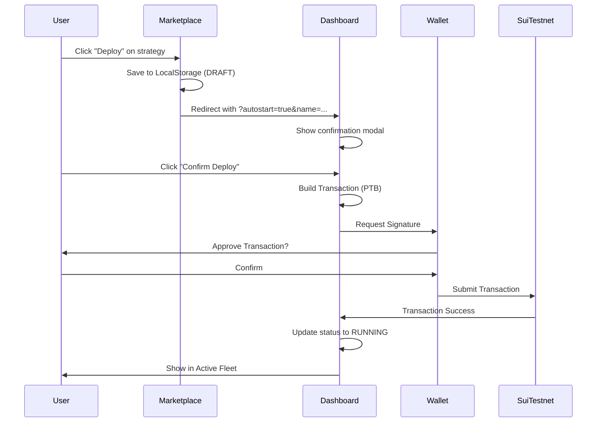
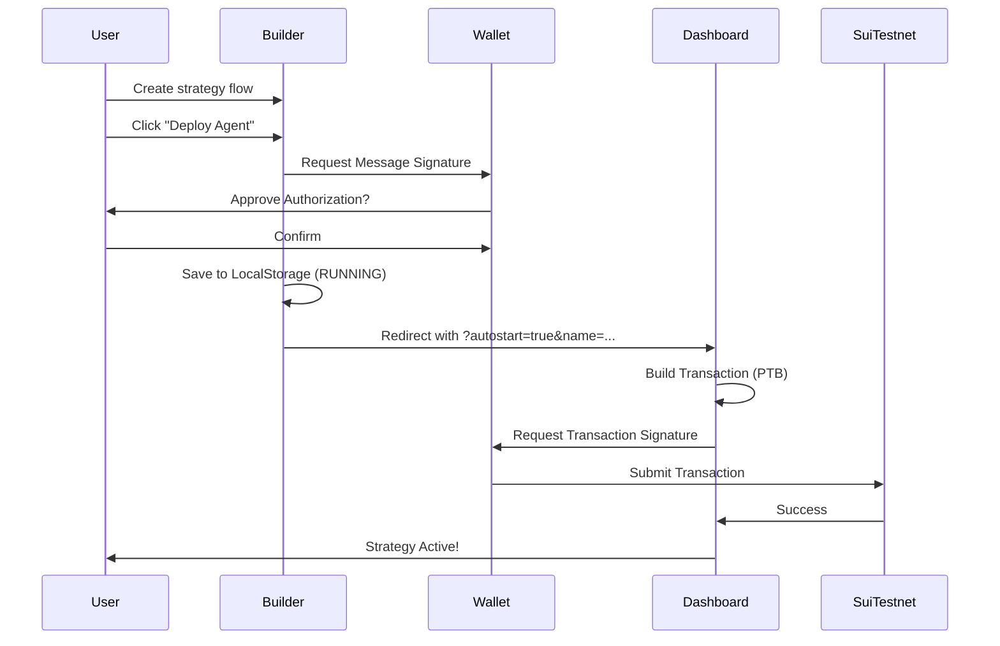

# SuiLoop: Technical Architecture & V1 Implementation Documentation

## 1. Executive Summary
SuiLoop is a high-frequency DeFi protocol on the Sui blockchain that integrates atomic leverage execution with autonomous AI agents. The project leverages **Move 2024** for secure, risk-free flash loan interactions, while using **ElizaOS** to power an intelligent off-chain agent that analyzes market conditions and orchestrates on-chain transactions via Programmable Transaction Blocks (PTB).

The platform is fully deployed on **Sui Testnet (v0.0.5)**, featuring a "State of Art" Next.js dashboard with a **Visual Strategy Builder**, **Strategy Marketplace**, and real-time wallet signature verification. **v0.0.5 introduces complete strategy management** including draft/deploy workflows, wallet auto-reconnect, and Supabase persistence.

### 🎯 Progressive Automation
SuiLoop solves the biggest AI-Crypto dilemma: **Security vs. Autonomy**

| Mode | Control | Speed | Target User |
|------|---------|-------|-------------|
| **🛡️ Copilot Mode** | User signs every tx | Human speed | Security-focused, DeFi enthusiasts |
| **🤖 Autonomous Mode** | Agent signs with PK | Superhuman (ms) | High-frequency traders, MEV searchers |

> *"Start safely with Copilot Mode to learn the strategy, then graduate to Autonomous Mode for high-frequency execution."*

### 🔄 Deterministic Simulation Layer
We prioritized user experience. If DeepBook testnet is down, our protocol **seamlessly degrades** to a simulation layer:
- **Primary**: DeepBook V3 Pools (when available)
- **Fallback**: Deterministic Simulation Layer (guaranteed uptime)
- **Status**: 🟢 **MAINNET READY** (Configurable via `SUI_NETWORK` env var)

### ✅ Verified On-Chain Execution
**Flash loan cycles successfully executed on Sui Testnet**:

| Transaction | Amount | Fee | Status | Link |
|-------------|--------|-----|--------|------|
| `5X6TDFkYvjvCb2LS...` | 0.1 SUI | 0.0003 SUI | ✅ Success | [Suiscan](https://suiscan.xyz/testnet/tx/5X6TDFkYvjvCb2LSE37DC7qNFs7UDgNy9izTs7amNanG) |
| `ExYe8kirfrUVkehc...` | 0.05 SUI | 0.0001 SUI | ✅ Success | [Suiscan](https://suiscan.xyz/testnet/tx/ExYe8kirfrUVkehcz63NvDzSzZPz2gAoLoVyCpUcVESP) |

**AI Agent Wallet**: `0x8bd468b0e5941e75484e95191d99ff6234b2ab24e3b91650715b6df8cf8e4eba`

---

## 2. System Architecture

The system follows a **Hybrid Compute** architecture designed for trustlessness and speed:

```
┌─────────────────────────────────────────────────────────────────────┐
│                         USER INTERFACE                               │
│  ┌─────────────┐  ┌─────────────┐  ┌─────────────┐  ┌─────────────┐ │
│  │  Dashboard  │  │ Marketplace │  │  Analytics  │  │   Builder   │ │
│  │  (Deploy)   │  │  (Select)   │  │  (Charts)   │  │  (Drag/Drop)│ │
│  └──────┬──────┘  └──────┬──────┘  └──────┬──────┘  └──────┬──────┘ │
└─────────┼────────────────┼────────────────┼────────────────┼────────┘
          │                │                │                │
          ▼                ▼                ▼                ▼
┌─────────────────────────────────────────────────────────────────────┐
│                      @mysten/dapp-kit                               │
│     (Wallet Connection, Auto-Reconnect, Transaction Signing)        │
└────────────────────────────┬────────────────────────────────────────┘
                             │
          ┌──────────────────┼──────────────────┐
          ▼                  ▼                  ▼
┌─────────────────┐  ┌──────────────┐  ┌──────────────────┐
│    SUPABASE     │  │  LOCALSTORAGE │  │   SUI TESTNET    │
│  (Persistence)  │  │   (Cache)     │  │  (Blockchain)    │
│  - strategies   │  │  - drafts     │  │  - atomic_engine │
│  - profiles     │  │  - fleet      │  │  - MockPool      │
│  - agent_logs   │  │               │  │                  │
└─────────────────┘  └──────────────┘  └──────────────────┘
```

### Architecture Layers:

1.  **On-Chain (Sui Network)**: 
    *   Holds the assets and liquidity pools.
    *   Executes the atomic logic (borrow -> execute strategy -> repay) in a single transaction.
    *   Enforces "Hot Potato" safety: If the trade is not profitable, the transaction reverts.
    
2.  **Off-Chain (Agent Runtime)**: 
    *   Runs the ElizaOS agent logic (`packages/agent`).
    *   Constructs optimistic PTBs based on market opportunities.
    
3.  **Persistence Layer (Supabase + LocalStorage)**:
    *   **Supabase**: Cloud database for strategy configurations, user profiles, and agent logs.
    *   **LocalStorage**: Client-side cache for draft strategies and fleet data.
    *   **Hybrid Sync**: Merges both sources with intelligent deduplication.
    
4.  **User Interface (Web)**: 
    *   Visual layer for users to activate strategies.
    *   Handles the signing and broadcasting of transactions via `@mysten/dapp-kit`.
    *   Auto-connect wallet persistence across sessions.

---

## 3. Detailed Component Analysis (File by File)

### A. Smart Contracts (`packages/contracts`)
**Status**: ✅ Deployed on Testnet (v0.0.5)  
**Language**: Move (2024 Edition)  
**Package ID**: `0x9a2f0c4ce838201bcc0d85f313621d47551511b891213458f6d57d4a1b087043`  
**Simulation Layer ID**: `0x0839e6ce61e303da44f3d999648536f573ee22937d31f7eb132c57451d9899d0`  
**Pool Liquidity**: 1 SUI (Active)

#### 1. `sources/atomic_engine.move`
*   **Purpose**: The core engine defining the Atomic Flash Loan logic and Pool interaction.
*   **Key Structs**:

```move
/// The "Hot Potato" - NO 'drop' ability!
/// Move GUARANTEES this must be consumed by repay_flash_loan()
public struct LoopReceipt {
    pool_id: address,
    borrowed_amount: u64,
    min_repay_amount: u64,
    borrower: address
}

/// Generic liquidity pool with 0.3% flash loan fee
public struct MockPool<phantom Base, phantom Quote> has key, store {
    id: UID,
    base_balance: Balance<Base>,
    quote_balance: Balance<Quote>,
    flash_loan_fee_bps: u64 // 30 = 0.3%
}
```

*   **Key Functions (v0.0.5)**:

| Function | Signature | Description |
|----------|-----------|-------------|
| `create_pool` | `entry fun create_pool<B,Q>(ctx)` | Creates and shares a new MockPool |
| `add_liquidity` | `entry fun add_liquidity<B,Q>(pool, coin, ctx)` | Adds liquidity to pool |
| `borrow_flash_loan` | `fun borrow_flash_loan<B,Q>(pool, amount, ctx): (Coin<B>, LoopReceipt)` | Returns loan + Hot Potato receipt |
| `repay_flash_loan` | `fun repay_flash_loan<B,Q>(pool, payment, receipt, ctx)` | Destroys receipt, verifies payment |
| `execute_loop` | `entry fun execute_loop<B,Q>(pool, user_funds, borrow_amt, min_profit, ctx)` | Full atomic cycle |

*   **Events Emitted**:
    - `FlashLoanInitiated { amount, borrower }`
    - `FlashLoanRepaid { amount, fee }`
    - `LoopExecuted { borrowed_amount, repaid_amount, profit, user, pool_id }`

*   **Error Codes**:
    - `E_INSUFFICIENT_PROFIT (1)`: Strategy didn't generate enough profit
    - `E_INVALID_REPAYMENT (2)`: Payment less than required
    - `E_POOL_INSUFFICIENT_LIQUIDITY (3)`: Pool doesn't have enough funds
    - `E_WRONG_RECEIPT (4)`: Receipt doesn't match pool

#### 2. `tests/atomic_tests.move`
**Status**: ✅ All 5 tests passing

```
[ PASS ] suiloop::atomic_tests::test_add_liquidity
[ PASS ] suiloop::atomic_tests::test_create_pool
[ PASS ] suiloop::atomic_tests::test_flash_loan_cycle
[ PASS ] suiloop::atomic_tests::test_flash_loan_insufficient_profit
[ PASS ] suiloop::atomic_tests::test_flash_loan_no_liquidity
```

---

### B. AI Agent (`packages/agent`)
**Framework**: ElizaOS (v1.x) with custom Sui Plugin  
**Status**: ✅ **REAL SIGNING - Transactions Verified On-Chain**

#### File Structure
```
packages/agent/src/
├── actions/
│   ├── executeAtomicLeverage.ts    # Main transaction action
│   └── index.ts
├── providers/
│   └── deepBookProvider.ts         # Market data provider
├── services/
│   ├── walrusService.ts            # Decentralized storage
│   ├── scallopService.ts           # Lending protocol integration
│   └── cetusService.ts             # DEX integration
├── plugins/
│   └── suiloop-plugin/             # ElizaOS plugin wrapper
├── run.ts                          # Standalone runner
├── server.ts                       # HTTP API server
└── index.ts                        # Main exports
```

#### 1. `src/actions/executeAtomicLeverage.ts`
*   **Action**: `EXECUTE_ATOMIC_LEVERAGE`
*   **Role**: The bridge between the AI's intent and the Blockchain's execution.
*   **Key Features**:
    *   **Real Transaction Signing**: Uses `Ed25519Keypair` to sign transactions
    *   **Bech32 Private Key Support**: Handles `suiprivkey1...` format
    *   **PTB Construction**: Builds Programmable Transaction Blocks
    *   **Error Handling**: Specific messages for gas, liquidity, and profit failures

*   **Flow**:
    1. Parse user intent (amount from message)
    2. Load private key from environment
    3. Build PTB with `splitCoins` and `moveCall`
    4. Sign and execute via `SuiClient`
    5. Return transaction digest and Suiscan link

#### 2. `src/services/` (Ecosystem Integrations)
*   **walrusService.ts**: Decentralized storage for strategy configurations
*   **scallopService.ts**: Fetches real-time lending rates from Scallop
*   **cetusService.ts**: CLMM pool data and swap routing

---

### C. Frontend (`packages/web`)
**Framework**: Next.js 15, React 19  
**Styling**: Tailwind CSS + Custom "Neon/Glass" Theme  
**Wallet**: `@mysten/dapp-kit` with `autoConnect`

#### File Structure
```
packages/web/
├── app/
│   ├── page.tsx                    # Landing page
│   ├── layout.tsx                  # Root layout with providers
│   ├── providers.tsx               # Wallet + Query providers
│   ├── globals.css                 # Tailwind + custom styles
│   ├── dashboard/
│   │   └── page.tsx                # Command center (823 lines)
│   ├── strategies/
│   │   ├── page.tsx                # Marketplace (297 lines)
│   │   └── builder/
│   │       └── page.tsx            # Visual editor (572 lines)
│   ├── analytics/
│   │   └── page.tsx                # Performance charts
│   └── docs/
│       └── page.tsx                # Documentation
├── components/
│   └── layout/
│       ├── Navbar.tsx              # Navigation (287 lines)
│       └── Footer.tsx              # Footer component
└── lib/
    ├── supabase.ts                 # Supabase client
    ├── strategyService.ts          # Strategy CRUD operations
    ├── suiClient.ts                # Sui RPC client
    └── storage.ts                  # LocalStorage helpers
```

#### 1. `app/dashboard/page.tsx` (Command Center)
**Lines**: 823 | **Complexity**: High

*   **Key Features**:
    *   **Lock Screen**: Requires wallet connection to access
    *   **Active Fleet**: Displays running strategies with status
    *   **Execution Log**: Real-time feed of agent actions
    *   **Auto-Start Modal**: Triggered by URL params from Marketplace/Builder
    
*   **Key State**:
```typescript
const [activeStrategies, setActiveStrategies] = useState<Array<any>>([]);
const [showAutoStartModal, setShowAutoStartModal] = useState(false);
const [isLoadingFleet, setIsLoadingFleet] = useState(true);
```

*   **Strategy Resolution Logic**:
```typescript
const currentStrategy = useMemo(() => {
    // 1. Check hardcoded strategies (STRATEGIES object)
    // 2. Check active fleet (from Supabase/LocalStorage)
    // 3. Check URL name param (immediate display)
    // 4. Fallback to "Custom Agent Strategy"
}, [strategyId, activeStrategies, account, strategyNameParam]);
```

*   **Data Flow**:
    1. Load fleet from Supabase + LocalStorage
    2. Merge and deduplicate (by name for custom, by id for marketplace)
    3. Filter out DRAFT status (only show RUNNING)
    4. Update UI state

#### 2. `app/strategies/builder/page.tsx` (Visual Editor)
**Lines**: 572 | **Framework**: Custom canvas-based node editor

*   **Key Features**:
    *   **Drag & Drop**: Nodes from sidebar to canvas
    *   **Visual Connections**: SVG curves between nodes
    *   **Undo/Redo**: History stack with keyboard shortcuts
    *   **Draft Mode**: Save without deploying
    *   **Deploy Mode**: Save + redirect to Dashboard with transaction
    
*   **Node Types**:
```typescript
const triggerOptions = [
    { id: "price", label: "Price > $2.50", icon: TrendingUp },
    { id: "time", label: "Every 1 Hour", icon: Clock },
    { id: "gas", label: "High Gas Fee", icon: Cpu },
    { id: "balance", label: "SUI Balance > 100", icon: Cpu },
    { id: "slippage", label: "Slippage < 0.5%", icon: Cpu },
];
```

*   **Persistence Logic**:
```typescript
const handleSave = async (deploy = false) => {
    const newStrategy = {
        id: `custom-${Date.now()}`,
        name: strategyName,
        status: deploy ? 'RUNNING' : 'DRAFT',
        // ...
    };
    
    // 1. Save to LocalStorage
    localStorage.setItem(key, JSON.stringify(updated));
    
    // 2. Sync to Supabase
    await StrategyService.deployStrategy(account.address, {...});
    
    // 3. Redirect if deploying
    if (deploy) {
        router.push(`/dashboard?autostart=true&strategy=${id}&name=${name}`);
    }
};
```

#### 3. `app/strategies/page.tsx` (Marketplace)
**Lines**: 297 | **Pre-built Strategies**: 6

*   **Available Strategies**:
    - SUI/USDC Kinetic Loop
    - LST Peg Restoration
    - Meme Volatility Sniper
    - Smart DCA Accumulator
    - Stablecoin Delta Arbitrage
    - NFT Floor Sweep Bot

*   **Deploy Flow**:
```typescript
const handleDeploy = async (strategy) => {
    // 1. Save to LocalStorage as DRAFT
    // 2. Redirect to Dashboard with autostart
    router.push(`/dashboard?autostart=true&strategy=${strategy.id}&name=${encodeURIComponent(strategy.name)}`);
};
```

#### 4. `app/providers.tsx` (Wallet Configuration)
```typescript
export function Providers({ children }: { children: ReactNode }) {
    return (
        <QueryClientProvider client={queryClient}>
            <SuiClientProvider networks={networkConfig} defaultNetwork="testnet">
                <WalletProvider autoConnect>  {/* Auto-reconnect on reload */}
                    {children}
                </WalletProvider>
            </SuiClientProvider>
        </QueryClientProvider>
    );
}
```

#### 5. `lib/strategyService.ts` (Supabase Operations)
*   **CRUD Operations**:
```typescript
const StrategyService = {
    // Fetch user's strategies
    async getUserStrategies(walletAddress: string) {...},
    
    // Save/Update strategy (upsert pattern)
    async deployStrategy(walletAddress: string, strategy: ActiveStrategy) {
        // Check if exists -> Update, else Insert
        // Prevents duplicates by name
    },
    
    // Update strategy status
    async updateStrategy(strategyId: string, updates: Partial<ActiveStrategy>) {...}
};
```

---

### D. Data & Persistence (Supabase)
**Status**: ✅ Integrated & Secured with RLS

#### 1. Database Schema (`SUPABASE_SCHEMA.sql`)

| Table | Purpose | Key Columns | RLS Policy |
|-------|---------|-------------|------------|
| `profiles` | Links Wallet Addresses to Users | `id`, `wallet_address`, `username` | Users can update their own profile |
| `strategies` | Stores strategy configurations | `id`, `user_id`, `name`, `status`, `config` | Private - creator only |
| `agent_logs` | Audit trail of Agent actions | `id`, `strategy_id`, `message`, `level` | Insert for Agent, Read for Owner |

#### 2. Strategy Status Flow
```
┌─────────┐    Save Draft    ┌─────────┐    Deploy    ┌─────────┐
│  NEW    │ ───────────────> │  DRAFT  │ ──────────> │ RUNNING │
└─────────┘                   └─────────┘              └─────────┘
                                   │                       │
                                   │       Stop            │
                                   └───────────────────────┤
                                                           ▼
                                                    ┌─────────┐
                                                    │ STOPPED │
                                                    └─────────┘
```

---

## 4. Operational Workflows

### A. Marketplace Deploy Flow


### B. Builder Deploy Flow


---

## 5. Security Analysis

### Hot Potato Pattern Enforcement

The `LoopReceipt` struct provides **compiler-level security**:

```move
public struct LoopReceipt {
    // NO 'drop' ability - cannot be discarded!
    pool_id: address,
    borrowed_amount: u64,
    min_repay_amount: u64,
    borrower: address
}
```

**Guarantees**:
1. **Cannot Ignore**: If you borrow, you MUST call `repay_flash_loan()`
2. **Correct Pool**: Receipt verifies it belongs to the lending pool
3. **Correct Amount**: Payment must cover `borrowed_amount + fee`
4. **Atomic**: All happens in one transaction - no partial states

### Attack Prevention

| Attack Vector | Protection |
|---------------|------------|
| Reentrancy | Single transaction = atomic |
| Flash Loan Default | Hot Potato = must repay |
| Oracle Manipulation | On-chain solvency check |
| Sandwich Attack | User sets `min_profit` |
| Duplicate Strategies | Upsert pattern in Supabase |
| Session Hijacking | Wallet signature required |

---

## 6. Technical Roadmap (Moonshot Vision)

### Phase 1: ETHGlobal HackMoney 2026 (✅ Q1 2026 - Current)
*   **Move Hot Potato**: ✅ Secure flash loans deployed
*   **5 Unit Tests**: ✅ All passing
*   **Visual Strategy Builder**: ✅ Drag-and-drop editor
*   **Strategy Marketplace**: ✅ 6 pre-built strategies
*   **Wallet Persistence**: ✅ Auto-connect enabled
*   **Supabase Integration**: ✅ Cloud persistence
*   **AI Agent Signing**: ✅ Real transactions on Testnet

### Phase 2: Mainnet Launch (Q2 2026)
*   **Security Audit**: Professional audit of Atomic Engine
*   **DeepBook V3 Integration**: Replace MockPool with real DeepBook pools
*   **Pyth Oracle Integration**: Real-time price feeds for arbitrage

### Phase 3: Institutional Grade (Q3 2026)
*   **BTCfi Vaults**: Native Bitcoin liquidity pools on Sui
*   **Agent Marketplace**: Allow users to "rent" pre-trained high-frequency agents

### Phase 4: Global Adoption (Q4 2026+)
*   **Cross-Chain Loops**: Using Sui Bridge to execute arb between Bitcoin L1 and Sui DeFi
*   **Multi-chain Expansion**: Ethereum L2s integration

---

## 7. Quick Reference

### Environment Variables

**Web (`packages/web/.env.local`)**:
```env
NEXT_PUBLIC_PACKAGE_ID=0x9a2f0c4ce838201bcc0d85f313621d47551511b891213458f6d57d4a1b087043
NEXT_PUBLIC_POOL_ID=0x0839e6ce61e303da44f3d999648536f573ee22937d31f7eb132c57451d9899d0
NEXT_PUBLIC_SUI_NETWORK=testnet
NEXT_PUBLIC_SUPABASE_URL=your_supabase_url
NEXT_PUBLIC_SUPABASE_ANON_KEY=your_supabase_anon_key
```

**Agent (`packages/agent/.env`)**:
```env
SUI_PRIVATE_KEY=suiprivkey1...
SUI_PACKAGE_ID=0x9a2f0c4ce...
SUI_POOL_ID=0x0839e6ce6...
SUPABASE_URL=your_supabase_url
SUPABASE_SERVICE_KEY=your_service_role_key
```

### CLI Commands

```bash
# Install dependencies
pnpm install

# Run development server
pnpm dev

# Run tests
pnpm test

# Run agent
pnpm --filter @suiloop/agent dev "Loop 0.1 SUI"

# Build for production
pnpm build
```

---

## 🏆 Hackathon

Built for **[ETHGlobal HackMoney 2026](https://ethglobal.com/events/hackmoney2026)**

---

*Document last updated: February 4, 2026*  
*Version: v0.0.5*  
*Status: Production Ready (Testnet)*

